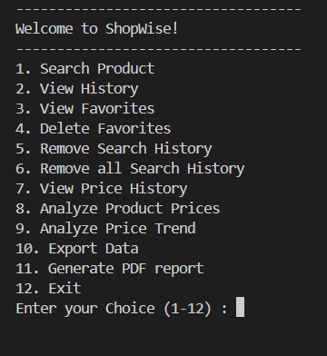
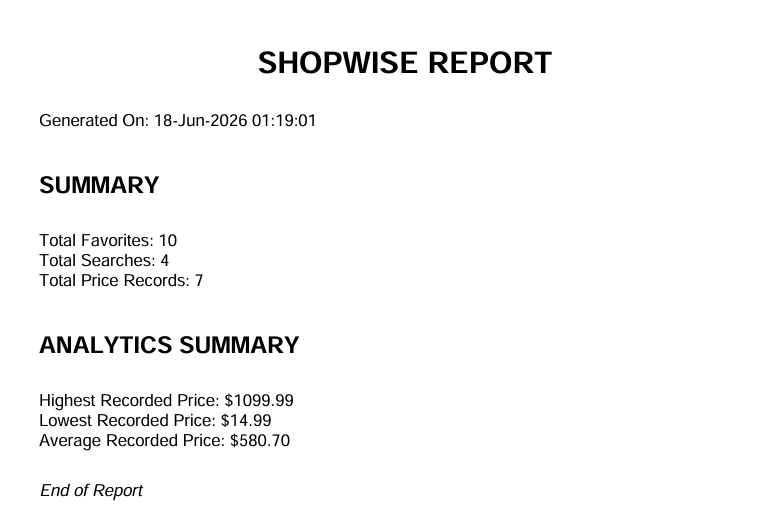

# ShopWise

A Python-based product tracking and analytics application that integrates with the DummyJSON API and PostgreSQL.

ShopWise allows users to search products, track price history, manage favorites, analyze pricing trends, export data to CSV, and generate professional PDF reports. The project is designed using a modular service-based architecture and demonstrates API integration, database management, data analysis, and file generation in Python.

---

## Features

* Search products using the DummyJSON API
* View detailed product information
* Save products to favorites
* View and manage favorites
* Track search history with date and time
* Track product price history
* Compare products using a custom ShopWise Score
* Analyze product pricing and buying recommendations
* Analyze price trends over time
* Export favorites, search history, and price history to CSV
* Generate timestamped PDF reports
* PostgreSQL database integration
* Environment variable configuration using `.env`

---

## Screenshots

### Main Menu



### Product Search


### Product Detail View


### CSV Export


### PDF Report Generation



---

## Technologies Used

* Python
* PostgreSQL
* Requests
* Psycopg
* Python-dotenv
* ReportLab
* Git & GitHub

---

## Project Structure

```text
ShopWise/
│
├── assets/
│   ├── main_menu.png
│   ├── product_search.png
│   ├── product_detail_view.png
│   ├── csv_export.png
│   └── pdf_report.png
│
├── data/
│
├── exports/      # Generated CSV exports
├── reports/      # Generated PDF reports
│
├── services/
│   ├── analytics_service.py
│   ├── comparison_service.py
│   ├── export_service.py
│   ├── favorite_service.py
│   ├── history_service.py
│   ├── report_service.py
│   └── trend_service.py
│
├── .env
├── .env.example
├── .gitignore
├── api_handler.py
├── database.py
├── main.py
├── README.md
├── requirements.txt
└── utils.py
```

---

## Installation

### 1. Clone the Repository

```bash
git clone <repository-url>
cd ShopWise
```

### 2. Create a Virtual Environment

```bash
python -m venv .venv
```

### 3. Activate the Virtual Environment

**Windows**

```bash
.venv\Scripts\activate
```

**macOS/Linux**

```bash
source .venv/bin/activate
```

### 4. Install Dependencies

```bash
pip install -r requirements.txt
```

---

## Environment Variables

Create a `.env` file in the project root:

```env
DB_HOST=localhost
DB_NAME=shopwise
DB_USER=postgres
DB_PASSWORD=your_password
```

---

## Database Setup

Create a PostgreSQL database named:

```text
shopwise
```

The required tables will be created automatically when the application starts.

---

## Running the Application

```bash
python main.py
```

---

## CSV Export Functionality

ShopWise can export the following data:

* Favorites
* Search History
* Price History

Generated CSV files are stored in the `exports/` directory.

---

## PDF Report Generation

ShopWise can generate timestamped PDF reports containing:

* Total Favorites
* Total Searches
* Total Price Records
* Highest Recorded Price
* Lowest Recorded Price
* Average Recorded Price
* Report Generation Timestamp

Generated reports are stored in the `reports/` directory.

---

## Sample Report Contents

```text
SHOPWISE REPORT

Generated On: 18-Jun-2026 12:30:00

SUMMARY

Total Favorites: 10
Total Searches: 25
Total Price Records: 15

ANALYTICS SUMMARY

Highest Recorded Price: $1099.99
Lowest Recorded Price: $199.99
Average Recorded Price: $799.99
```

---

## Key Learning Outcomes

This project demonstrates:

* REST API Integration
* PostgreSQL Database Operations
* Environment Variable Management
* Modular Software Architecture
* Data Analysis and Trend Evaluation
* CSV File Generation
* PDF Report Generation
* Error Handling and Input Validation
* Git and GitHub Workflow

---

## Future Improvements

* FastAPI integration
* Interactive web dashboard
* Data visualization charts
* Unit testing with Pytest
* User authentication
* Scheduled report generation
* Email report delivery

---

## Author

Built as a portfolio project to strengthen practical skills in Python development, database management, API integration, and software design.
